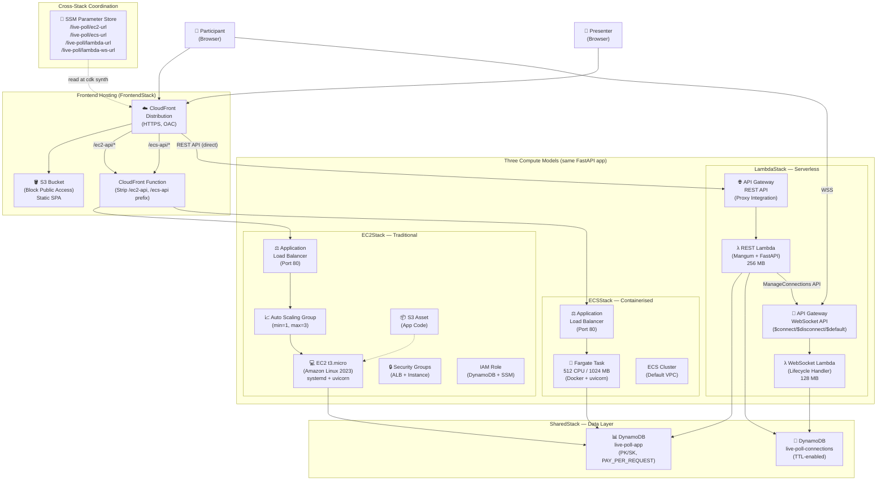
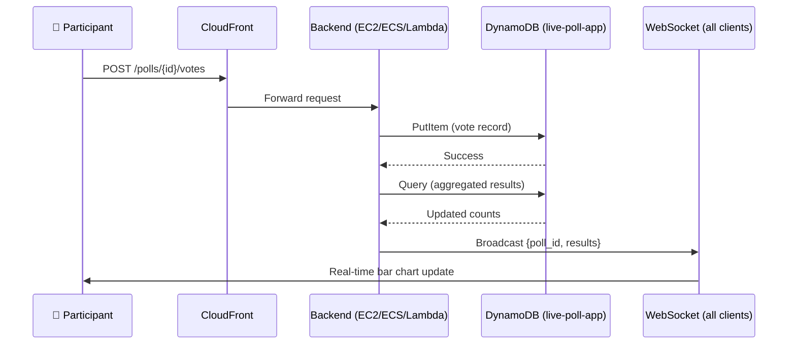
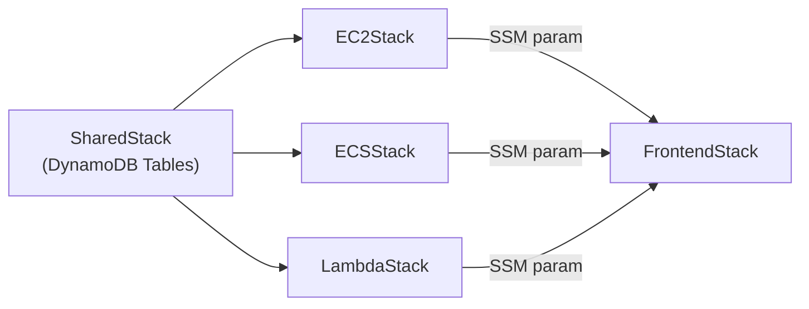

# AWS Architecture Diagram — Live Poll App

> **Editable diagram with AWS icons:** Open [`architecture.drawio`](./architecture.drawio) in [draw.io](https://app.diagrams.net) or the VS Code Draw.io Integration extension. The file uses the official `mxgraph.aws4` icon library.

## High-Level Architecture

## Data Flow — Vote Lifecycle

## Stack Dependency Map

## Service Inventory

| AWS Service | Stack | Purpose |
|---|---|---|
| **DynamoDB** | SharedStack | Main data store (polls, votes) + WebSocket connections |
| **EC2** | EC2Stack | Traditional compute (t3.micro, Amazon Linux 2023) |
| **ALB** | EC2Stack | Application Load Balancer (port 80 → instance 80) |
| **Auto Scaling Group** | EC2Stack | Min 1, max 3 instances with health checks |
| **Security Groups** | EC2Stack | ALB (public HTTP) + Instance (ALB-only HTTP) |
| **IAM Role** | EC2Stack | EC2 instance profile (DynamoDB + SSM access) |
| **S3 Asset** | EC2Stack | Application code bundle uploaded to S3 |
| **ECS Fargate** | ECSStack | Container compute (512 CPU / 1024 MB) |
| **ALB** | ECSStack | Load balancer (port 80 → container 8000) |
| **ECR** | ECSStack | Docker image registry (via `from_asset`) |
| **Lambda** | LambdaStack | REST handler (Mangum) + WebSocket handler |
| **API Gateway REST** | LambdaStack | HTTPS proxy to REST Lambda |
| **API Gateway WebSocket** | LambdaStack | WSS connection lifecycle management |
| **S3** | FrontendStack | Static SPA hosting (private, OAC) |
| **CloudFront** | FrontendStack | CDN, HTTPS termination, API proxying |
| **CloudFront Functions** | FrontendStack | URL prefix stripping for EC2/ECS proxy |
| **SSM Parameter Store** | All compute + Frontend | Cross-stack URL sharing |

## Region & Account

- **Region:** `eu-west-2` (London) — configurable in `cdk/cdk_config.py`
- **Account:** Set in `cdk/cdk_config.py` (not committed to source control)
